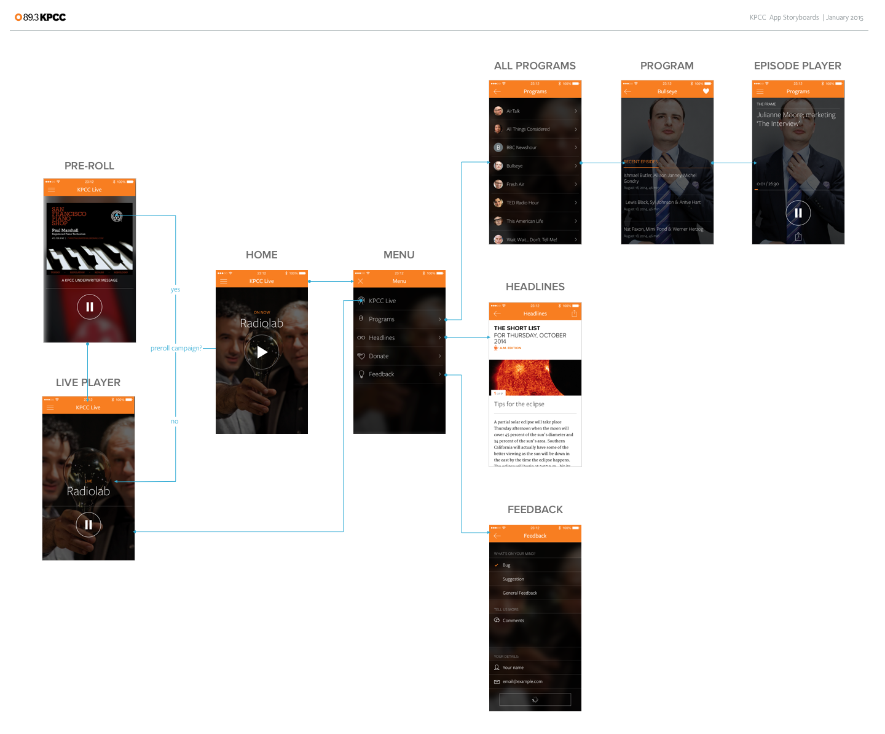

## Platform and Device Requirements

- [ ] Based on current Android app metrics, we should support Android 4.1 and above
- [ ] Our focus in terms of screen sizes are small through large screens (Android Developers - Supporting Different Screens)[http://developer.android.com/training/basics/supporting-devices/screens.html]. If adding support for x-large screens was a quick win we'd definitely consider adding it.

## Storyboard of Key Views

Here's a high-level view of all the key screens in the app and how they fit together:

**A note about stream rewinding features:** Android has poor support for HTTP Live Streaming, which we've found is the best way to deliver StreamMachine's live rewind features. Because of that and our desire to get an app to market soon, we're choosing not to implement any of the live rewind features in this first version of the Android app.

## Prototypes

We created a number of interactive prototypes to document the small animations and transitions we were trying to achieve in certain spots. Here are links to relevant prototypes:

* [On-Demand Player: Swiping Between Episodes](http://scpr.github.io/KPCC-iPhone-Prototypes/prototype.iphone.programs-prev-next.framer/)
* [Live Player: Loading preroll from a cold start](http://scpr.github.io/KPCC-iPhone-Prototypes/prototype.iphone.home-preroll.framer/)
* [App Onboarding](http://scpr.github.io/KPCC-iPhone-Prototypes/prototype.iphone.onboarding.framer/)

A lot of these design and interaction details (especially the use of blurred images) have a distinctly iOS aesthetic to them, and I need your expertise in assessing whether this design will feel appropriate for Android, and also whether there are native APIs or 3rd party libraries that will make it possible to accomplish this on Android without a large amount of effort. So consider these prototypes a conversation starter rather than a firm target to hit.

## Assets

Sean will work to prepare and export all icons, images and sounds so they can be dropped in to the project. ETA 2/6.

## Additional Features

- [ ] Onboarding (open for discussion; do we want to try and implement the full iPhone onboarding experience, or design and implement a much simpler one in the interest of time?)
- [ ] Push Notifications: Outpost will push "Listen Live" breaking news events to a channel in Parse that our phone apps can use to let listeners know when something important is happening on the live stream. This feature is optional if time permits, and would be implemented using Google Cloud Messaging

## Business Rules

### Home/KPCC Live
- [ ] Grab Current Program from Schedule and render appropriate program image
- [ ] Connect to http://live.scpr.org/aac for live stream
- [ ] Check if a current active preroll campaign exists; if yes, kick off preroll sequence when live stream played
- [ ] If it's a brand new install and onboarding has been completed, ignore the preroll, if not:
- [ ] If the user terminates the app and then re-opens the app and presses play, load the pre-roll if it exists and play it. But:
- [ ] If the user backgrounds the app in a "paused" state and then returns and the buffer is expired (i.e. the return date is now > 4 hours since the pause) then load the pre-roll if it exists and play it.
- [ ] When delivering preroll, disable menu button to prevent unwanted interactions until preroll completes
- [ ] Preroll will be a combination of a preroll audio file and a 300x250 display ad, both served by the Triton ad server. Documentation for using the Triton on-demand API can be found [here](ondemand_advertising_guide_1.3.8_2014-11-26.pdf).

### Live Stream Player
- [ ] Use Play/Stop function on Android app (Instead of play/pause button on iPhone)
- [ ] Orange progress is optional in Android: since we won't have live rewind it's not essential that we give users a cue about where they are in the current program

### Onboarding
- [ ] Only run onboarding sequence the first time a user launches the app after install or update
- [ ] Onboarding can be paused/resumed at any time
- [ ] If a user leaves the app in the middle of onboarding and returns hours or days later, start onboarding from the beginning
- [ ] After onboarding has finished, deliver the user to the Home/KPCC Live view

### All Programs
- [ ] List all programs from the API endpoint where `air_status=onair`
- [ ] If program avatar doesn't exist, render a generic gray avatar with the first letter of the show (ignoring the word "The")

### Single Program Episode
- [x] Display the 8 most recent episodes for a program

### On-Demand Player
- [ ] The on-demand player allows users to swipe right/left to skip to the previous/next episode
- [ ] When an episode ends, the player automatically loads the next episode from that show
- [ ] Once you've listened to all the recent episodes for a show, the player will stop playing
- [ ] The orange progress bar advances to indicate how far into the current audio file you have listened
- [ ] when loading/buffering a new episode, the player state changes to give users a clear cue that the app is trying to load the next episode

### Headlines
- [x] When a user drills into the Headlines section, instantiate an in-app web view that loads http://www.scpr.org/short-list/latest#no-prelims
- [x] As users tap on links and drill into full articles from the Short List, the app should capture the HTML <title> attribute for the current page and render a truncated version of it into the app's navigation bar

### Donate
- [x] When tapped, the donate button should launch the default web browser on the phone and load https://scprcontribute.publicradio.org/contribute.php

### Other

#### Program Background Images

- [ ] For all screens where a program background image is rendered: program images are hosted on Media, located at http://media.scpr.org/iphone/program-images/*. The program images in this directory conform to a consistent file naming convention that uses the Program.slug as part of the filename, like so:

http://media.scpr.org/iphone/program-images/program_tile_fresh-air@2x.jpg

- [ ] The app will need to construct a URL like this based on the program slug and fetch the appropriate image. Since these images change infrequently and we want to minimize network requests, we should consider caching these images on the device so we don't have to request them constantly.

- [ ] If the app requests an image for a program from Media and gets a 404, We have a generic fallback image that can be used:

http://media.scpr.org/iphone/program-images/program_tile_generic@2x.jpg

#### Analytics

- [ ] We're using Mixpanel as the platform for tracking sessions and engagement with our apps. Docs are [here](https://mixpanel.com/help/reference). The Mixpanel SDK will need to be added and initialized to send basic session info, but in addition we want to send specific events to Mixpanel to track engagement in the app. A full list of events we want to track can be found [here](events_schema_KPCCforiPhone-RC1.xlsx).
